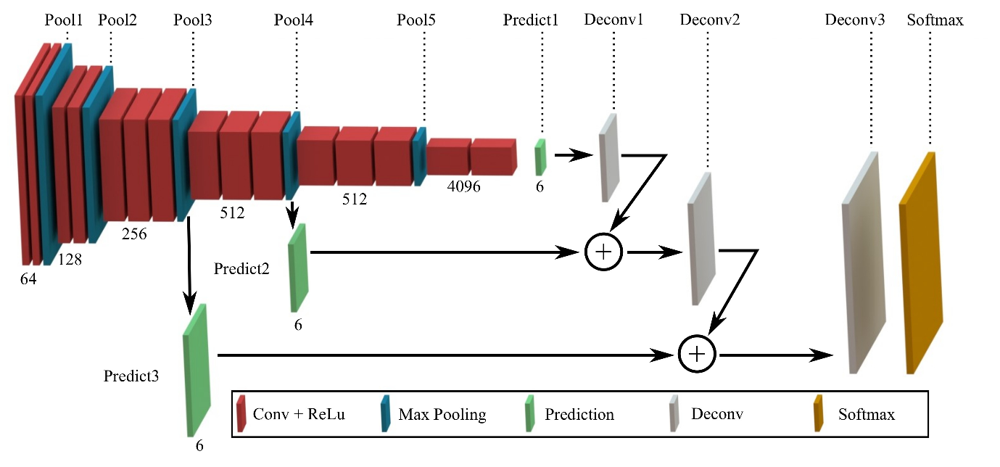

# Term - 3 - Project - 2 : Semantic Segmentation
Self-Driving Car Engineer Nanodegree Program - Semantic Segmentation

---
## Semantic Segmentation Project Output

This video demonstrates how the Semantic Segmentation using Fully Convolutional Network (FCN):

[](https://youtu.be/ci90CxebD0o)


## Introduction

Real-time scene understanding based upon camera images is a major part in nowadays’ perception modules for mobile robotics and self-driving cars. In the DNN domain, this can be solved by Fully Convolutional Networks (FCNs) that perform semantic segmentation in a single forward-pass. As the name suggests, a semantic segmentation FCN assigns each pixel of the input image to one of the predefined classes such as \"road\" or \"sky\": This output from the perception stage can effectively be fed into localization and path-planning modules.

To give you a first impression of the task environment for this project, look at the following frame and its pixel-wise, hand-labeled annotation from the Cityscapes dataset, a poplular Semantic Segmentation dataset that we will be using (this frame has been captured in Cologne, and you actually see the Cologne Cathedral on the horizon). For now, just think of every color in the image to the right as a different class (you may be able to guess the color-to-class mapping):
 
 <table><tr><td></td><td></td></tr></table>
 
This lab takes a classification network as a baseline and shows how to turn it into an FCN architecture that will be trained on a down-scaled subset of Cityscapes for several epochs. 

A Neural Network such as an FCN is nothing else than a long series of computations depending on each other from layer to layer – knowing a network's topology allows us to estimate how many operations are needed to perform one or more predictions. This information is very useful to meet practical requirements, given by e.g. the embedded platform we develop for, how many images we need to process in a specific use case, and/or what minimum detection performance is needed. 

The goal of this project is to identify the road within a series of driving images. To do this, we use an approach called semantic segmentation, which enables us to associate each pixel of an image with a class label. The two fundamental classes for this project are 'road' and 'not road.' However, with a more robust data set it's possible to classify a variety of different objects such as cars, pedestrians, buildings, trees, bicyclists, etc.


### High Level Project Objectives
1. Extracting pretrained VGG-16 feature encoder.
2. Implementing FCN-8 decoder
3. Data Augmentation
4. Train the model on Kitti Road dataset 
5. Apllying the model to test data
6. Applying the model to Video

For our semantic segmentation model we need to build and train a Fully Convolutional Network (FCN), using [this research paper](https://people.eecs.berkeley.edu/~jonlong/long_shelhamer_fcn.pdf) from Berkeley as a guide.

Below is a diagram of the model architecture. Notice there are two skip layers which feed the output from layer 3 and layer 4 in the encoder into the second and third layer of the decoder. This helps preserve fidelity that is otherwise lost through subsequent convolutions during encoding.

</a>

A FCN is usually comprised of two parts: encoder and decoder (as seen below):


The purpose of the encoder is to extract features from the image, while the decoder is responsible for upscaling the output, so that it ends up the same size as the original image. Another advantage of using an FCN is that since convolutional operations really do not care about the size of the image, FCN can work on an image of any size. In a classic CNN with fully connected layers at the end, the size of the input is always constrained by the size of the fully connected layers. 

One drawback of using convolutions or encoding in general is that we get "tunnel vision", where we look very closely at some features and lose the bigger picture in the end. Information gets lost when moving through layers because of this narrow scope. Skip connections provide a way of retaining the information easily. By connecting the output of one layer to a non-adjacent layer, skip connections allow the network to ustilize information from multiple resolutions that may have been optimized away. This results in the network being able to make more precise segmentation decisions. 


## Data
The initial model was trained using the [KITTI road detection data set](http://www.cvlibs.net/datasets/kitti/eval_road.php).

In the future, I'd like to enhance the model and train it on a more robust data set such as [Cityscapes](https://www.cityscapes-dataset.com/). However, accessing this data requires explicit permission from their team.

</a>

## Data Augmentation
two technique for data augmentation. the first one is to flip the training data set from left to right. the second one is brightness augmentation by converting image to HSV and then scaling up or down the V channel randomly with a factor of 0.25. This was implemented in the gen_batch_function() in helper.py.

## Network Architecture

A pre-trained VGG-16 network model was used a an encoder by extracting the input, keep probability, layer3, layer4, layer7. The model was converted to FCN-8 by adding decoder network as following:
1. 1x1 convolution layer from VDD's layer7
2. 1x1 convolution layer from VDD's layer4
3. 1x1 convolution layer from VDD's layer3
4. Upsampling 1x1 layer7 with kernel 4 and strid 2
5. skip layer for 1x1 layer4 and upsamled the layer above
6. upsampling 1x1 layer4 with kernel 4 and strid 2
7. skip layer for 1x1 layer3 and upsamled the layer above
8. upsamling above layer with kernel 16 and stride 8

## Hyperparameters
Here are the hyperparameters used during training
1. random-normal kernel initializer with standard deviation 1e-3 in all convolutional and upsampling layer
2. L2 kernel regularizer with L2 1e-5 in all convolutional and upsampling layer
3. Epoch=50
4. Batch size= 8
5. Keep probabilites = 0.5
6. Learning rate= 1e-4

## Optimizer
The loss function for the network is cross-entropy, and oprimizer used is Adam optimizer.

## Results and Video Output
Although far from perfect, I was able to get my model to recognize the road with a good degree of accuracy after 20 epochs.

</a>

Result Video:

[](https://youtu.be/ci90CxebD0o)

Here is the resulting cross-entropy loss. Below is a graph that shows an exponential decay in loss over 50 epochs:

</a>


## Future Improvements
Ultimately, this is a simple approach that works well for this particular data set. Trying to extend this model for use on a self-driving car would require some improvements.
* Train on more robust data set such as [Cityscapes](https://www.cityscapes-dataset.com/).
* Add augmentation script to generate additional training examples and a greater variety of samples.
* Freeze model to improve performance.
* Add ability to take video as direct input.

---

# Project Starter Code
In case you want to run this project yourself, below is the project starter code. [This repository](https://github.com/udacity/CarND-Semantic-Segmentation) contains all the code needed.

### Setup
##### GPU
`main.py` will check to make sure you are using GPU - if you don't have a GPU on your system, you can use AWS or another cloud computing platform.
##### Frameworks and Packages
Make sure you have the following is installed:
 - [Python 3](https://www.python.org/)
 - [TensorFlow](https://www.tensorflow.org/)
 - [NumPy](http://www.numpy.org/)
 - [SciPy](https://www.scipy.org/)
##### Dataset
Download the [Kitti Road dataset](http://www.cvlibs.net/datasets/kitti/eval_road.php) from [here](http://www.cvlibs.net/download.php?file=data_road.zip).  Extract the dataset in the `data` folder.  This will create the folder `data_road` with all the training a test images.

### Start
##### Implement
Implement the code in the `main.py` module indicated by the "TODO" comments.
The comments indicated with "OPTIONAL" tag are not required to complete.
##### Run
Run the following command to run the project:
```
python main.py train -ep=50 -bs=8
```
**Note** If running this in Jupyter Notebook system messages, such as those regarding test status, may appear in the terminal rather than the notebook.

### Submission
1. Ensure you've passed all the unit tests.
2. Ensure you pass all points on [the rubric](https://review.udacity.com/#!/rubrics/989/view).
3. Submit the following in a zip file.
 - `helper.py`
 - `main.py`
 - `project_tests.py`
 - Newest inference images from `runs` folder  (**all images from the most recent run**)

 ### Tips
- The link for the frozen `VGG16` model is hardcoded into `helper.py`.  The model can be found [here](https://s3-us-west-1.amazonaws.com/udacity-selfdrivingcar/vgg.zip)
- The model is not vanilla `VGG16`, but a fully convolutional version, which already contains the 1x1 convolutions to replace the fully connected layers. Please see this [forum post](https://discussions.udacity.com/t/here-is-some-advice-and-clarifications-about-the-semantic-segmentation-project/403100/8?u=subodh.malgonde) for more information.  A summary of additional points, follow.
- The original FCN-8s was trained in stages. The authors later uploaded a version that was trained all at once to their GitHub repo.  The version in the GitHub repo has one important difference: The outputs of pooling layers 3 and 4 are scaled before they are fed into the 1x1 convolutions.  As a result, some students have found that the model learns much better with the scaling layers included. The model may not converge substantially faster, but may reach a higher IoU and accuracy.
- When adding l2-regularization, setting a regularizer in the arguments of the `tf.layers` is not enough. Regularization loss terms must be manually added to your loss function. otherwise regularization is not implemented.

### Using GitHub and Creating Effective READMEs
If you are unfamiliar with GitHub , Udacity has a brief [GitHub tutorial](http://blog.udacity.com/2015/06/a-beginners-git-github-tutorial.html) to get you started. Udacity also provides a more detailed free [course on git and GitHub](https://www.udacity.com/course/how-to-use-git-and-github--ud775).

To learn about REAMDE files and Markdown, Udacity provides a free [course on READMEs](https://www.udacity.com/courses/ud777), as well.

GitHub also provides a [tutorial](https://guides.github.com/features/mastering-markdown/) about creating Markdown files.
